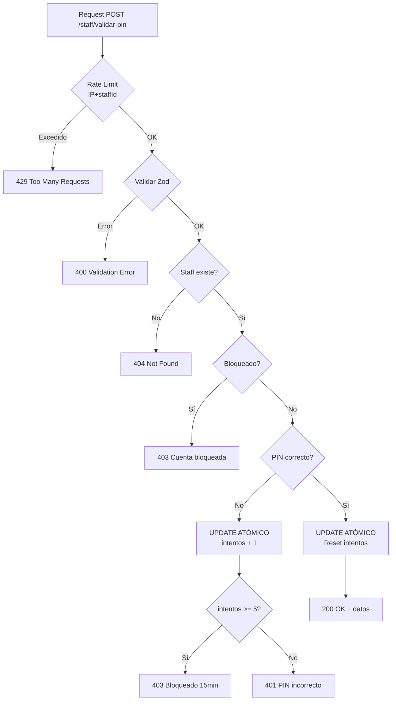

# Estrategia de Seguridad - Validación de PIN

## 🎯 Doble Control de Seguridad

### 1. Rate Limit por IP + staffId
**Objetivo**: Frenar bots y ataques distribuidos

```typescript
keyGenerator: (request) => {
    const body = request.body as { staffId?: string }
    const ip = request.ip
    const staffId = body?.staffId || 'unknown'
    return `${ip}-${staffId}`
}
```

- **Límite**: 5 intentos por minuto
- **Scope**: Combinación de IP + staffId
- **Protege contra**: 
  - ✅ Bots que intentan múltiples PINs desde la misma IP
  - ✅ Ataques distribuidos que rotan IPs pero atacan la misma cuenta

### 2. Lock por Cuenta
**Objetivo**: Frenar ataques focalizados al staff aunque cambien IP

- **Límite**: 5 intentos fallidos
- **Bloqueo**: 15 minutos
- **Scope**: Por cuenta de staff
- **Protege contra**:
  - ✅ Ataques que cambian de IP constantemente
  - ✅ Múltiples atacantes coordinados
  - ✅ Ataques de fuerza bruta distribuidos

---

## ⚛️ Operaciones Atómicas

### Problema de Concurrencia

Sin operaciones atómicas, dos requests simultáneos pueden causar:

```
Request A lee: intentos = 3
Request B lee: intentos = 3
Request A escribe: intentos = 4
Request B escribe: intentos = 4  ❌ Debería ser 5!
```

### Solución Implementada

**UPDATE atómico con RETURNING**:

```sql
UPDATE staff 
SET intentos_pin_fallidos = intentos_pin_fallidos + 1,
    bloqueado_hasta = CASE 
        WHEN intentos_pin_fallidos + 1 >= 5 
        THEN NOW() + INTERVAL '15 minutes'
        ELSE bloqueado_hasta
    END
WHERE id = ${staffId}
RETURNING intentos_pin_fallidos, bloqueado_hasta
```

**Ventajas**:
- ✅ Incremento atómico (no hay race condition)
- ✅ Cálculo de bloqueo en la misma operación
- ✅ Retorna el nuevo valor en una sola query
- ✅ PostgreSQL garantiza atomicidad a nivel de fila

---

## 🔄 Flujo Completo



---

## 📊 Comparación de Estrategias

| Escenario | Rate Limit IP+staffId | Lock por Cuenta | Resultado |
|-----------|----------------------|-----------------|-----------|
| Bot desde 1 IP | ✅ Bloqueado | - | Detenido en 5 intentos/min |
| Ataque distribuido (múltiples IPs, 1 cuenta) | ⚠️ Parcial | ✅ Bloqueado | Detenido después de 5 intentos totales |
| Usuario legítimo olvidó PIN | ✅ Permite reintentos | ✅ Bloqueo temporal | Balance entre seguridad y UX |
| Múltiples cuentas desde 1 IP | ✅ Bloqueado | - | Detenido en 5 intentos/min por cuenta |

---

## 🛡️ Garantías de Seguridad

### Contra Race Conditions
- ✅ **Atomicidad**: PostgreSQL garantiza que el UPDATE es atómico
- ✅ **Consistencia**: No hay lecturas sucias entre SELECT y UPDATE
- ✅ **Aislamiento**: Cada transacción ve un estado consistente

### Contra Ataques
- ✅ **Bots**: Rate limit por IP los detiene rápidamente
- ✅ **Ataques distribuidos**: Lock por cuenta los detiene eventualmente
- ✅ **Timing attacks**: No hay diferencia de tiempo entre PIN correcto/incorrecto en la validación

---

## 💡 Consideraciones Adicionales

### ¿Por qué no usar transacciones explícitas?

Con `postgres` (la librería que usamos), las operaciones individuales ya son transaccionales. El UPDATE atómico es suficiente porque:

1. Solo modificamos una fila
2. El incremento es atómico a nivel de base de datos
3. No necesitamos coordinar múltiples tablas

### ¿Cuándo usar transacciones explícitas?

Si en el futuro necesitas:
- Registrar logs de intentos en otra tabla
- Actualizar múltiples tablas relacionadas
- Hacer rollback condicional

Entonces sí usarías:

```typescript
await sql.begin(async sql => {
    // Múltiples operaciones aquí
    await sql`UPDATE staff ...`
    await sql`INSERT INTO audit_log ...`
})
```

---

## ✅ Checklist de Implementación

- [x] Rate limit por IP + staffId
- [x] UPDATE atómico para incrementar intentos
- [x] Cálculo de bloqueo en la misma query
- [x] RETURNING para obtener nuevos valores
- [x] Manejo de bloqueo temporal
- [x] Reset atómico cuando PIN es correcto
- [ ] Índice en columna `bloqueado_hasta` (recomendado para performance)
- [ ] Índice compuesto en `(id, bloqueado_hasta)` (opcional)
