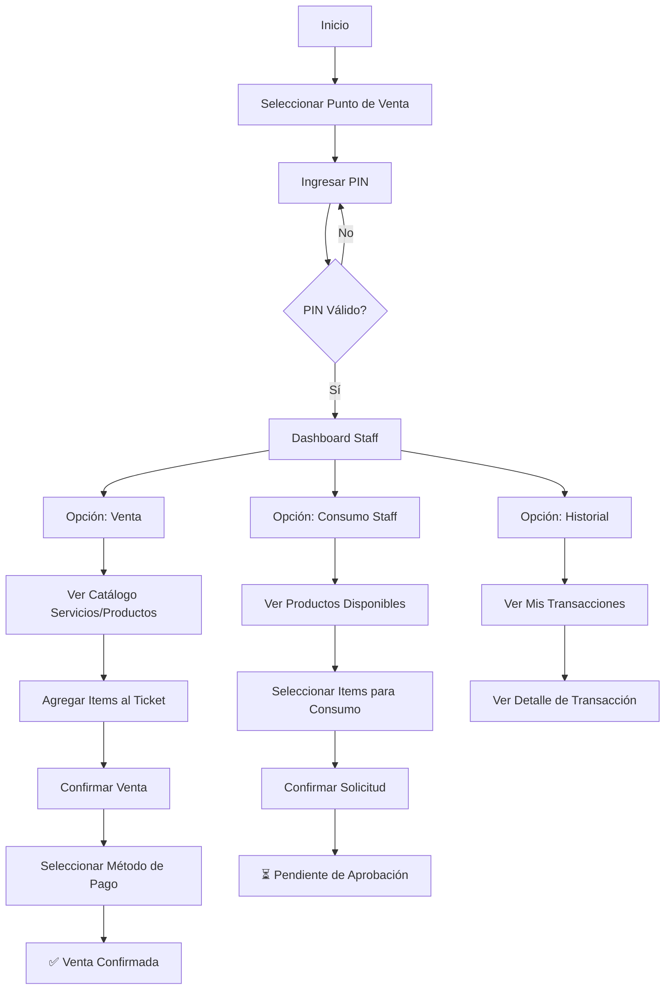
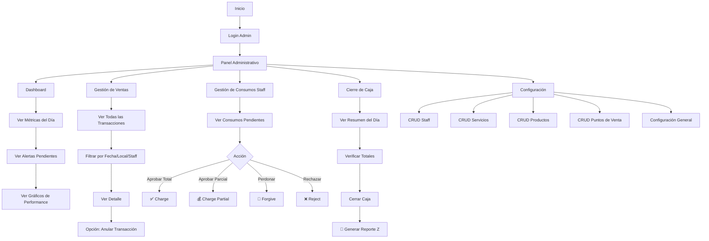
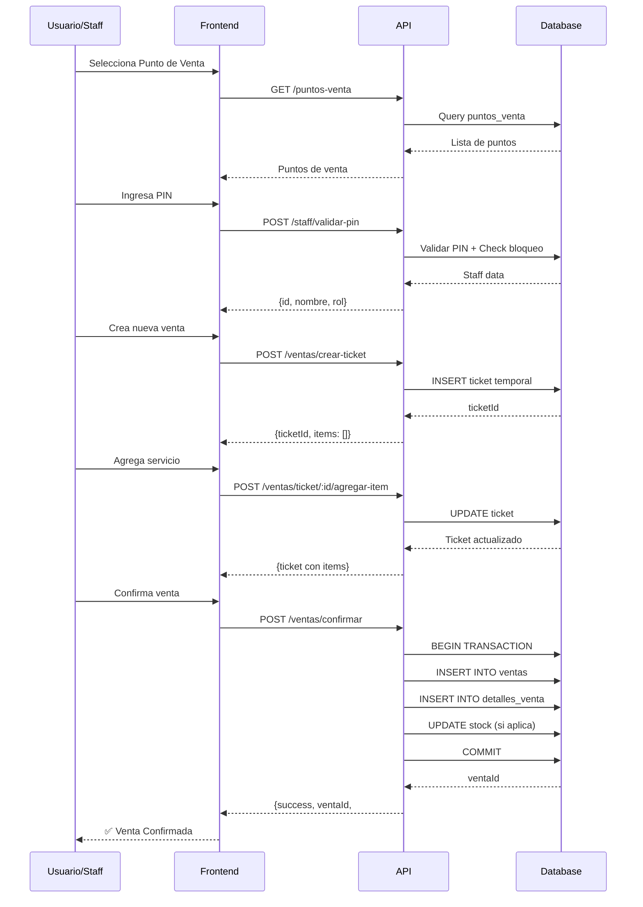
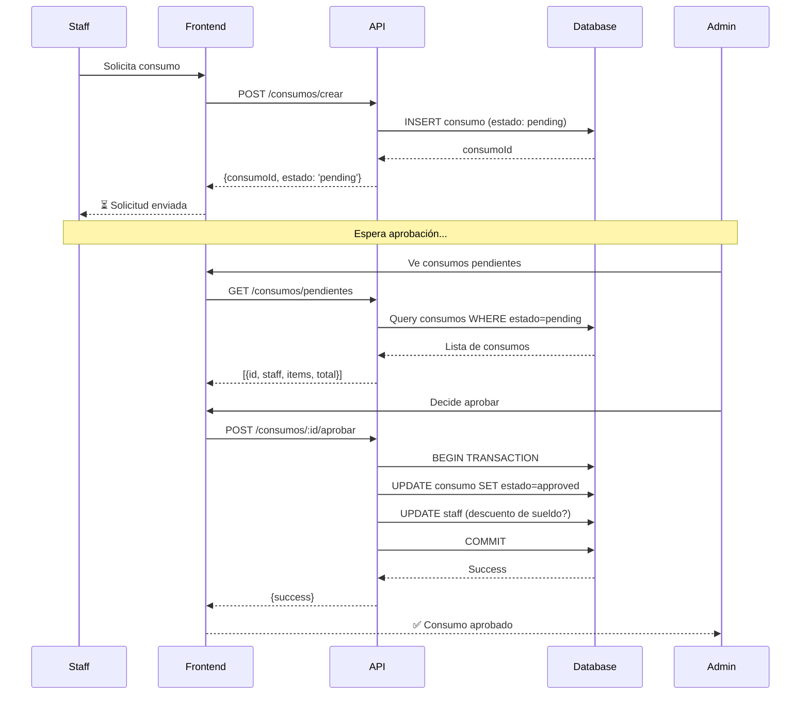

# User Flows - Gestión Peluquería

## 👤 Flujo Usuario Base (Peluquero/Staff)

## 👨‍💼 Flujo Usuario Admin

## 🔄 Flujo Detallado: Venta Completa

## 🔄 Flujo Detallado: Consumo Staff

---

## 📊 Matriz de Endpoints por Flujo

| Flujo | Endpoints Necesarios | Prioridad |
|-------|---------------------|-----------|
| **Login y Sesión** | `/staff/validar-pin`, `/puntos-venta`, `/session/punto-venta` | 🔴 Alta |
| **Venta Básica** | `/catalogo/*`, `/ventas/confirmar` | 🔴 Alta |
| **Venta con Carrito** | `/ventas/crear-ticket`, `/ventas/ticket/*` | 🟡 Media |
| **Consumo Staff (Staff)** | `/consumos/crear`, `/consumos/pendientes` | 🔴 Alta |
| **Consumo Staff (Admin)** | `/consumos/:id/aprobar`, `/consumos/:id/perdonar`, etc. | 🟡 Media |
| **Historial** | `/transacciones`, `/transacciones/:id` | 🟡 Media |
| **Cierre de Caja** | `/caja/*` | 🟢 Baja |
| **Admin Dashboard** | `/admin/dashboard`, `/admin/alertas` | 🟢 Baja |
| **CRUD Config** | `/admin/staff`, `/admin/servicios`, etc. | 🟢 Baja |
